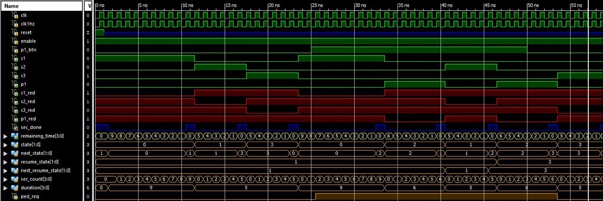

# FPGA Traffic Light Controller

## Course
Digital Logic Laboratory

## Description
Designed and implemented an FPGA-based smart pedestrian crossing system using Verilog and Xilinx ISE Design Suite. The system controls three traffic roads and one pedestrian crossing signal while managing traffic priorities and timing sequences.

## Simulation
The controller FSM was simulated to verify traffic light sequencing, pedestrian crossing requests, and countdown timing behavior.

## Project Type
Team project (2 students)

## Technologies
- Verilog
- Xilinx ISE Design Suite
- Nexys-A7 FPGA Board
- Digital Logic Design

## Features
- Three-road traffic light control
- Pedestrian crossing request button
- Priority-based traffic sequencing
- Seven-segment display countdown timer
- FPGA implementation and simulation

## Files
- Verilog source code
- Xilinx project files
- Controller simulation screenshot
